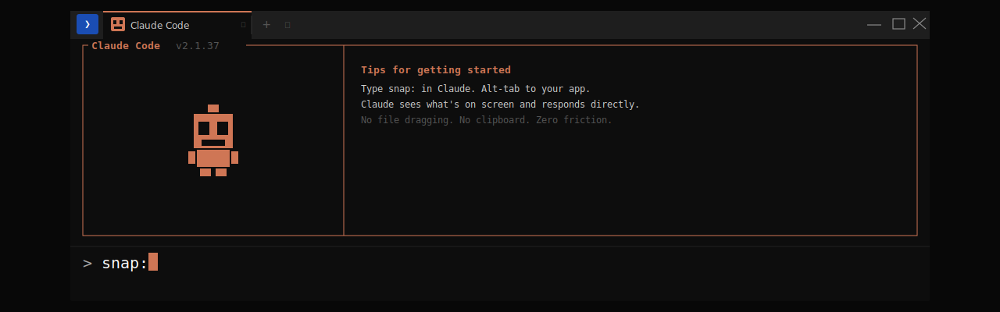
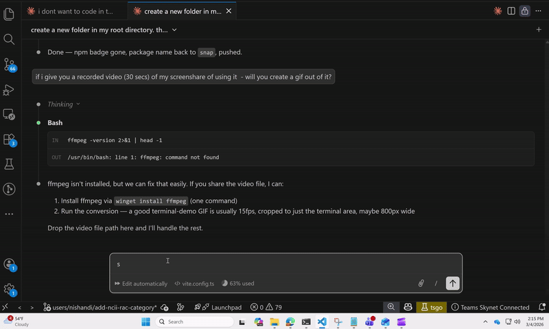

# snap:

[](LICENSE)



Let your AI see what you see — instantly.

---

## Why I built this

Vibe coding with AI has a rhythm: make a change, look at the browser, see something wrong, screenshot it, drag it into the chat, type your question, wait, repeat. The screenshot step is a tiny thing that breaks the flow every single time. I got personally frustrated with it enough that I decided to fix it.

But here's the thing — I'm not an engineer. I can't write Node.js or PowerShell off the top of my head. What I can do is describe the problem precisely, push back when something feels wrong, and hold the line on simplicity. That turned out to be enough.

There's something I find genuinely exciting about that. Engineers are brilliant, but they often build for other engineers. They reach for npm, git, the command line — tools that feel natural to them and completely alien to everyone else. Non-engineers have been locked out of building software not because they lack ideas, but because the tools required a different kind of fluency.

AI is changing that. `snap:` is a tool built by a non-engineer, for non-engineers. Every decision that made it simpler — the one-command install, the automatic hook setup, no API key, no JSON to edit by hand — came from someone who would have been scared off by those things. That's not a limitation. That's the feature.

---

## How it works



How well snap works depends on how you use Claude. Here's the order from best to least seamless:

---

### Scenario A — Claude Code in a terminal window ✦ best experience

This covers: **Claude Code** running in Command Prompt, PowerShell, or Windows Terminal — where you type `claude` to start a session.

This is where `snap:` shines. Everything stays in one flow — you never leave the terminal. Type `snap:` as your message, hit Enter, alt-tab to the window you want to show. A notification pops up, dings count down, chimes play on capture — and Claude reads the screenshot and responds automatically. No clipboard. No switching apps. No extra steps.

```
snap: why does this button look off?
snap: is this layout right?
snap:
```

(No question after the colon = Claude describes what it sees and flags anything that looks broken.)

---

### Scenario B — The Claude extension inside VS Code

This covers: **the Claude Code extension in VS Code** specifically — not Copilot, not other AI extensions. If you're not sure which you have, look for the Claude icon in the VS Code sidebar.

Same seamless experience as Scenario A — type `snap:` in the Claude chat panel, hit Enter, alt-tab. Claude reads the screenshot and responds automatically.

```
snap: does this component look right?
snap:
```

> **Using Copilot or another AI inside VS Code?** See Scenario C below.

---

### Scenario C — AI in a browser tab (Claude.ai, ChatGPT, Copilot, etc.)

This covers: **Claude.ai**, **ChatGPT**, **Microsoft Copilot**, or any AI you open in a browser — including Copilot inside VS Code.

This still saves time compared to manually screenshotting, but it's the least seamless option — you'll still be switching between windows to paste. Open Command Prompt, PowerShell, or Windows Terminal. Type `snap` and hit Enter. Alt-tab to the window you want to capture. Chimes play, screenshot lands on your clipboard — switch to your browser and paste (Ctrl+V) into the chat.

```
snap
⏳ Grabbing in 3s... alt-tab now  3  2  1
📸 Screenshot on clipboard — Ctrl+V to paste
```

---

## A note on privacy

`snap:` captures your entire screen and sends it to your AI. Before you snap, glance at what's visible — close anything you wouldn't want shared: emails, passwords, personal information, confidential work documents, or anything with sensitive data in it.

The screenshot is sent only to whichever AI you're using (Claude, ChatGPT, etc.) and is not stored anywhere else. But treat it like any message you'd send — once it's in the chat, it's in the chat.

---

## Installation

> **Windows only.** Mac support is not available yet.

### Step 1 — Download

Click the green **Code** button on this page → **Download ZIP**. Unzip it anywhere (your Desktop is fine).

### Step 2 — Run the installer

Open the unzipped folder. Find the file called **`install.ps1`**.

Right-click it → **"Run with PowerShell"**.

The installer will:
- Check if Node.js is installed (and open the download page if not)
- Set up the snap command
- Wire up the Claude Code hook automatically

If it asks *"Do you want to allow this app to make changes?"* — click **Yes**.

> **If Node.js isn't installed yet:** The installer will open nodejs.org for you. Download the version marked **LTS**, run it (just click Next on everything), then run `install.ps1` again.

### Step 3 — Restart Claude Code or VS Code

If you have Claude Code or VS Code open, close and reopen it. The hook won't activate until you do.

> If you only use AI in a browser (Claude.ai, ChatGPT, Copilot), you can skip this step — the `snap` command already works.

### Step 4 — Test it

**Test `snap:` (Scenario A — Claude Code in terminal)**

In your Claude Code session, type this and hit Enter, then immediately alt-tab to your browser:
```
snap:
```
You should hear the countdown, see a notification pop up, hear chimes — then Claude responds with a description of what's on your screen.

**Test `snap:` (Scenario B — Claude extension in VS Code)**

In the Claude chat panel in VS Code, type `snap:` and hit Enter, then immediately alt-tab to your browser. Same experience as above.

**Test `snap` (Scenario C — browser AI)**

Open Command Prompt, PowerShell, or Windows Terminal and type:
```
snap
```
You should hear three dings, then chimes, and see a message saying the screenshot is on your clipboard.

---

## Troubleshooting

**"snap is not recognized as a command"**
→ Node.js might not be installed. Open Command Prompt or PowerShell and type `node --version`. If you get an error, go to nodejs.org, install the LTS version, then run `install.ps1` again.
→ If Node is installed, try running `install.ps1` again — but this time right-click → **Run as Administrator**.

**`snap:` not working in Claude Code (terminal)**
→ Make sure you fully closed and reopened the terminal window where Claude Code runs after installation.
→ Run `install.ps1` again — it's safe to run multiple times.

**`snap:` not working in the Claude VS Code extension**
→ Close VS Code completely and reopen it (not just reload the window).
→ Run `install.ps1` again — it's safe to run multiple times.

**No sound or no notification**
→ Check your system volume isn't muted or at zero.

**Screenshot comes out black**
→ Try alt-tabbing a moment earlier — the window needs to be fully visible when the chimes play.

---

## Under the hood

`snap` is a tiny Node.js script with zero dependencies. It uses built-in Windows tools (PowerShell + Windows GDI) to capture the screen and copy it to your clipboard.

`snap:` uses a Claude Code feature called a hook — a script that runs automatically before every message. When your message starts with `snap:`, the hook takes a screenshot and quietly tells Claude where to find it. Claude reads the image file and includes it in its context before responding. No API key needed. No third-party services. Just your machine and your AI.

---

*P.S. Claude cooked all of this up. Every line of code, the countdown sounds, the balloon notification, the installer — all of it came out of a back-and-forth conversation where I described what I wanted, pushed back when it felt complicated, and kept asking for simpler. Constraints shape the product. And it turns out constraints are best verbalized in plain language — which is something anyone can do.*

---

## License

MIT
